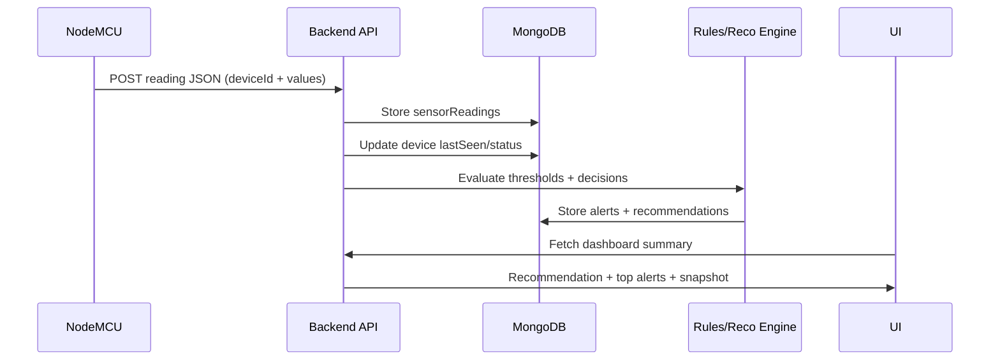

# AgroSense AI

AgroSense AI is a **real-world IoT smart agriculture decision system**.

It’s not just a dashboard that shows sensor numbers — it **analyzes real-time readings** and produces:
- **Actionable recommendations** (e.g., irrigation decision)
- **Alerts** (low moisture, high temperature, device offline)
- A **data-aware AI Assistant** (grounded in current + past farm data)

---

## System Overview

### Hardware → Backend → AI → UI flow

```mermaid
flowchart LR
	A[Sensors\nMoisture • DHT11 • pH • Rain] --> B[NodeMCU / ESP8266]
	B -->|WiFi| C[Node.js Backend API]
	C --> D[(MongoDB)]
	D --> E[Rules Engine\nAlerts + Recommendations]
	E --> F[External LLM\nClaude / OpenAI / Groq\n(grounded context)]
	E --> G[Next.js UI\nDashboard + Alerts + Devices]
	F --> H[AI Assistant (Chat UI)]
	C --> G
```

### Device ingestion (one-way MVP → two-way later)



---

## Key Features (Target)
- Real-time sensor monitoring (minimal, decision-first UI)
- Device status tracking (online/offline + lastSeen)
- Alerts system (active/acknowledged/archived)
- Recommendations engine (rules-first, explainable)
- AI Assistant (external LLM, but **always grounded** with farm context)
- Analytics (minimal, actionable trends — avoid chart overload)

---

## User Roles (Pro/Realistic)
- **Owner/Admin**: add devices, configure thresholds/zones, view everything
- **Worker/Operator**: handle alerts, perform actions, limited settings
- **Advisor/Agronomist (optional)**: read-only + guidance
- **Viewer (optional)**: read-only

---

## Repository Structure
- `client/` — Next.js app (UI)
- `server/` — backend services/APIs (to be implemented)
- `docs/` — planning docs (scope, API plan, beginner guide)

---

## Documentation
- `docs/AgroSenseAI_Scope_and_Plan.md` — full project scope + milestones + LLM grounding approach
- `docs/AgroSenseAI_API_Plan.md` — API list & counts (NodeMCU↔Backend, Client↔Backend)
- `docs/NodeMCU_Arduino_and_IoT_Flow_Beginner_Guide.md` — Arduino IDE + IoT beginner explanation

---

## Tech Stack
### Client
- Next.js (App Router)
- React
- Tailwind CSS
- Framer Motion

### Backend (planned)
- Node.js API
- MongoDB
- External LLM provider (Claude/OpenAI/Groq)

---

## Getting Started (Client)

### Prerequisites
- Node.js (LTS recommended)
- npm

### Run the UI

```bash
cd client
npm install
npm run dev
```

Open:
- `http://localhost:3000/` — Dashboard
- `http://localhost:3000/ai-assistant` — AI Assistant (chat UI)

### Build / Lint

```bash
cd client
npm run lint
npm run build
npm start
```

---

## Notes
- The backend is planned inside `server/`. UI currently uses demo/static data.
- If you add environment variables later, prefer `client/.env.local` for local development (do not commit secrets).
